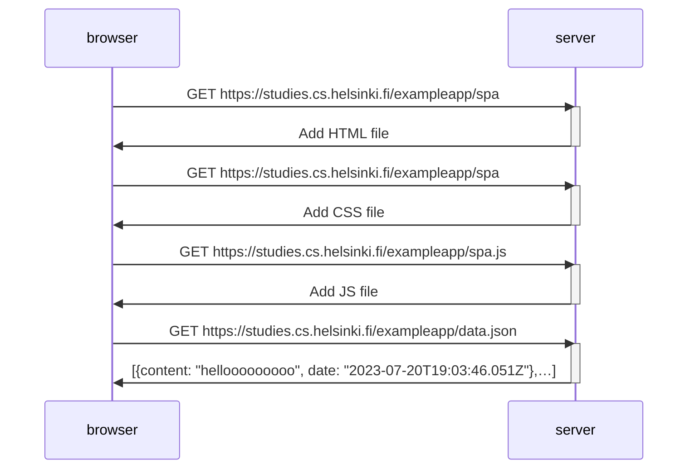

```mermaid
sequenceDiagram
   participant browser
   participant server

   browser->>server: GET https://studies.cs.helsinki.fi/exampleapp/spa
   activate server
   server->>browser: Add HTML file
   deactivate server

   browser->>server: GET https://studies.cs.helsinki.fi/exampleapp/spa
   activate server
   server->>browser: Add CSS file
   deactivate server

   browser->>server: GET https://studies.cs.helsinki.fi/exampleapp/spa.js
   activate server
   server->>browser: Add JS file
   deactivate server

   browser->>server: GET https://studies.cs.helsinki.fi/exampleapp/data.json
   activate server
   server->>browser: [{content: "hellooooooooo", date: "2023-07-20T19:03:46.051Z"},…]
   deactivate server
```
